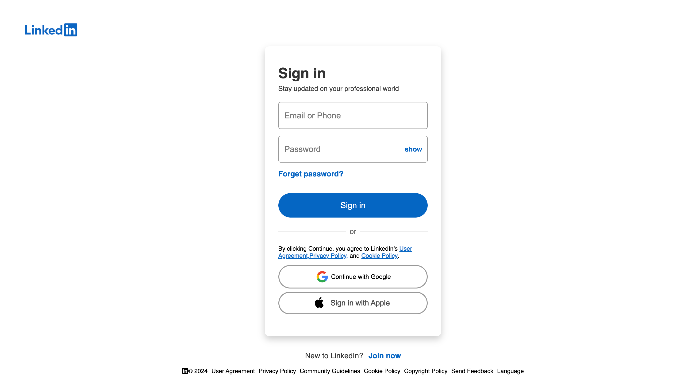
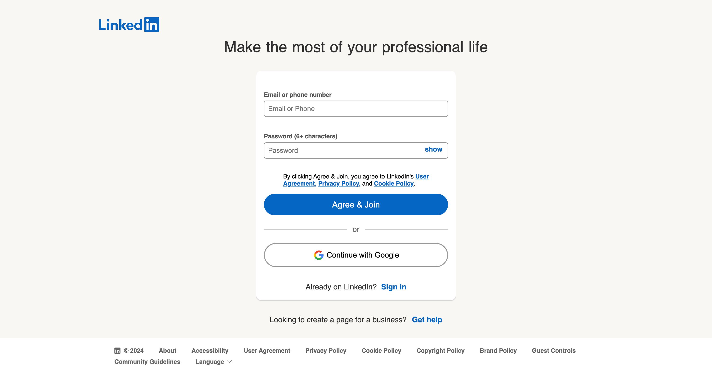
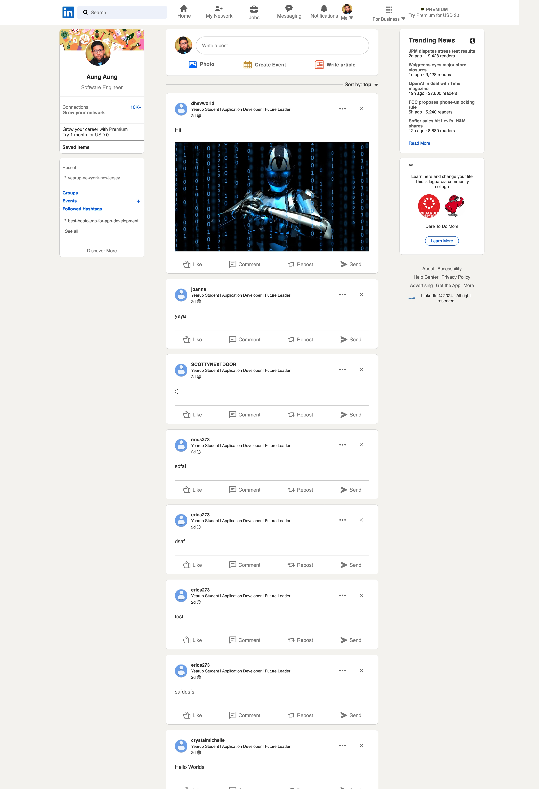
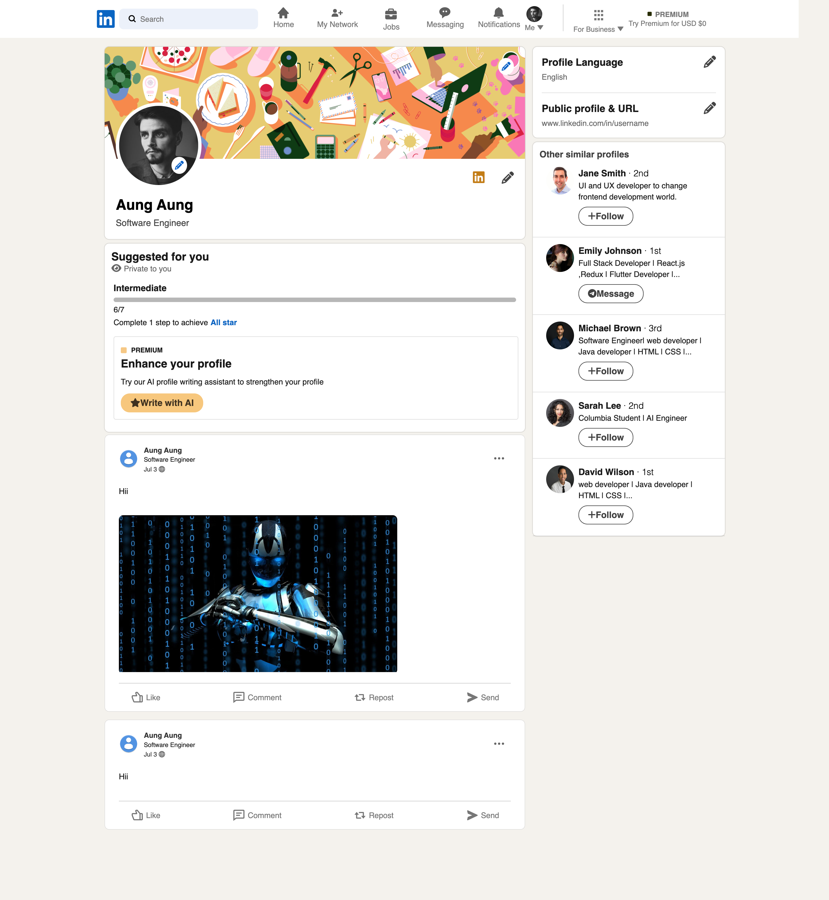
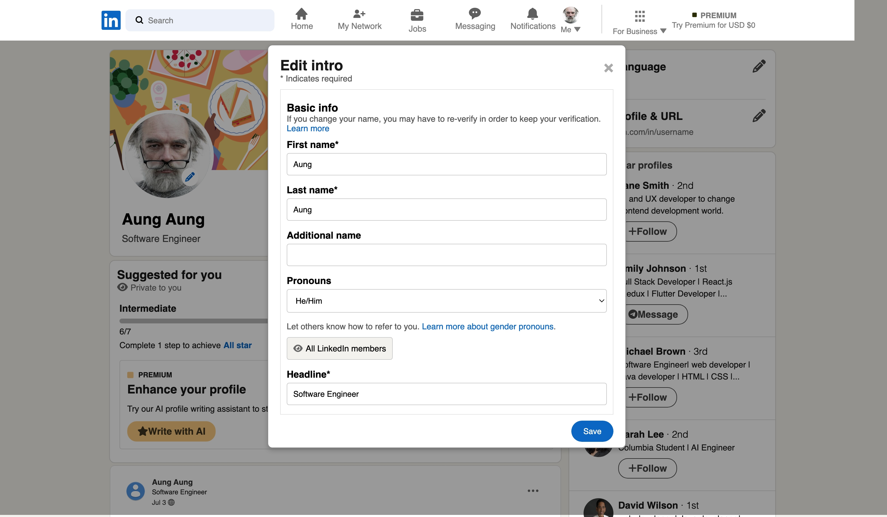
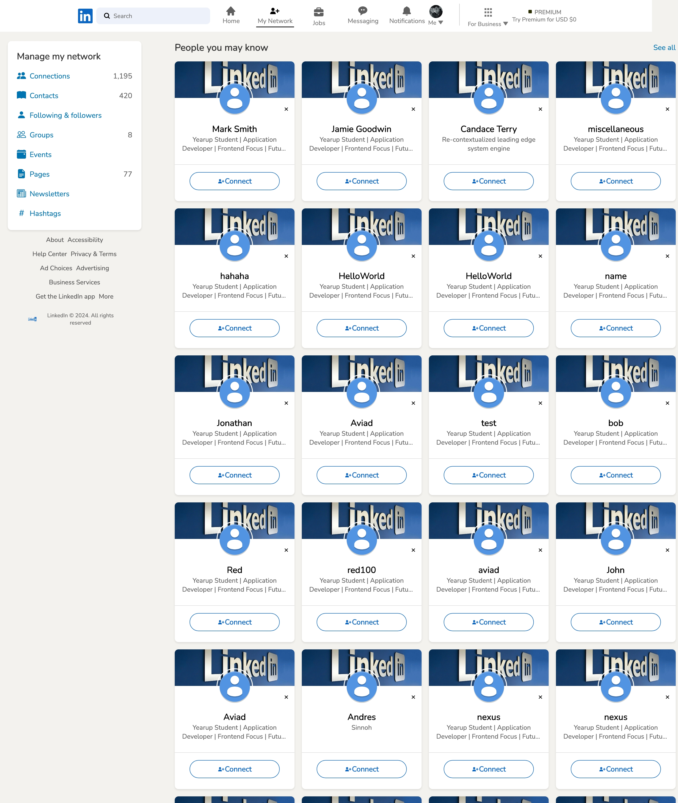

# LinkedIn Clone using Microblog API

## Overview

This project is a LinkedIn clone web application built using HTML, CSS, API, and JavaScript. The application leverages the Microblog API to implement microblogging functionalities.

## Features

- User Authentication and Authorization (Sign Up, Sign Out)
- Profile Creation and Management (Edit Bio and Name)
- Post Creation, Editing, and Deletion
- Like and Unlike Posts
- Search Functionality for Users and Posts
- View All Users

## Screenshots

### Home Page

### Sign In

### Join Now

### Feeds Page

### Profile

### Edit Profile

### Users Profile

## API Documentation

Detailed API documentation for the Microblog API can be found [here](http://microbloglite.us-east-2.elasticbeanstalk.com/docs/).

## Credit 📜

Enjoy the Microblog Project and the MicroblogLite API! Don't forget to read the MicroblogLite API docs and experiment with the API in Postman!

Practice and experimentation provide experience, and experience provides confidence.
